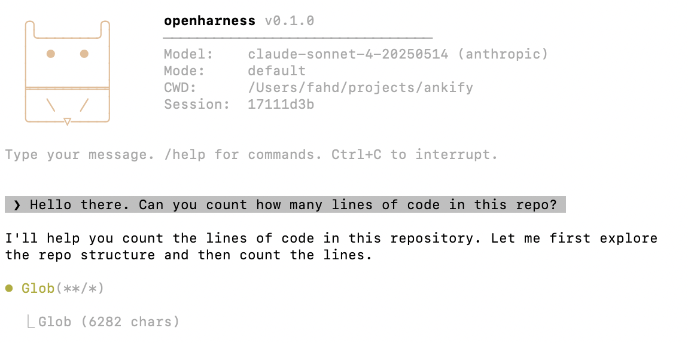

# OpenHarness

An extensible, multi-provider AI coding assistant for the terminal. Written in TypeScript with an Ink-based UI, OpenHarness connects to Anthropic Claude, OpenAI, Google Gemini, and any OpenAI-compatible endpoint — giving you 19 built-in tools, 30+ slash commands, custom agents, lifecycle hooks, MCP integration, and a plugin system, all in a single CLI.



## Highlights

- **Multi-provider** — Switch between Anthropic, OpenAI, Gemini, or local models (Ollama, LM Studio, vLLM) with one env var
- **19 built-in tools** — File I/O, shell execution, code search, web search/fetch, subagent tasks, notebooks, and more
- **30+ slash commands** — Session management, model switching, diagnostics, memory, plan mode, undo, clipboard
- **Plugin architecture** — Register tools, commands, hooks, and prompt segments through a unified `Plugin` interface
- **6 extension mechanisms** — Skills, custom agents, hooks, MCP servers, plugins, and prompt overrides — from zero-code markdown to full TypeScript
- **Session management** — Save, resume, search, tag, and rename conversations
- **Smart permissions** — 4 modes (default, acceptEdits, bypassPermissions, plan) with pattern-based auto-approval
- **Extended thinking** — Configurable thinking budgets for Claude and Gemini with toggleable display
- **Context management** — Auto-compaction at 80% context window; manual `/compact` with preservation instructions
- **Claude Code compatible** — Read-only import of sessions, memory, commands, MCP configs, hooks, and permissions from `~/.claude/`

## Supported Providers

| Provider | Models | Thinking | Caching | Local |
|----------|--------|----------|---------|-------|
| **Anthropic Claude** | Opus 4, Sonnet 4, Haiku 4.5 | Budget-based | Automatic | No |
| **OpenAI** | GPT-4o, GPT-4o-mini, o1, o3 | Internal (o1/o3) | No | No |
| **Google Gemini** | 2.5 Flash/Pro, 3 Flash/Pro, 3.1 Pro | Budget-based | No | No |
| **OpenAI-Compatible** | Any (Ollama, LM Studio, Groq, Together, Mistral, etc.) | No | No | Yes |

## Quick Start

```bash
# Install globally
npm install -g @alhazmiai/openharness

# Set your API key
export ANTHROPIC_API_KEY=sk-ant-...
# Or: export OPENAI_API_KEY=sk-...
# Or: export GEMINI_API_KEY=...

# Start the interactive REPL
oh

# Or run a one-shot prompt
oh -p "Explain this codebase"
```

### CLI Options

| Option | Description |
|--------|-------------|
| `-m, --model <model>` | Model alias (`opus`, `sonnet`, `haiku`) or full ID (`gpt-4o`, `gemini-2.5-flash`) |
| `-p, --prompt <text>` | One-shot mode — run prompt and exit |
| `--max-turns <n>` | Maximum agentic turns per interaction |
| `--thinking-budget <n>` | Extended thinking budget in tokens (min 1024) |
| `--permission-mode <mode>` | `default` / `acceptEdits` / `bypassPermissions` / `plan` |
| `-r, --resume <id>` | Resume a previous session |
| `--system-prompt <text>` | Custom system prompt override |
| `-v, --verbose` | Show detailed token usage and costs |

### Provider Selection

```bash
# Anthropic Claude (default)
oh

# OpenAI
LLM_PROVIDER=openai oh -m gpt-4o

# Google Gemini
LLM_PROVIDER=gemini oh -m gemini-2.5-flash

# Local Ollama
LLM_PROVIDER=openai-compat OPENAI_BASE_URL=http://localhost:11434/v1 oh -m llama3.2
```

## Built-in Tools

| Tool | Description |
|------|-------------|
| `Read` | Read files (text, images, PDFs, notebooks) |
| `Write` | Create new files |
| `Edit` | Exact string replacement edits |
| `Bash` | Execute shell commands |
| `Glob` | Fast file pattern matching |
| `Grep` | Content search via ripgrep |
| `WebSearch` | Web search (Brave or Serper) |
| `WebFetch` | Fetch and extract content from URLs |
| `Task` | Spawn subagent tasks (built-in + custom agent types) |
| `NotebookEdit` | Edit Jupyter notebook cells |
| `TodoWrite` | Structured task tracking |
| `EnterPlanMode` / `ExitPlanMode` | Toggle read-only plan mode |

All tools are async generators that yield `progress` (transient UI) and `result` (AI-visible) events, enabling real-time streaming output.

## Slash Commands

**Session:** `/exit`, `/clear`, `/sessions [query]`, `/resume [id]`, `/rename <name>`, `/tag <tag>`

**Model:** `/model [name]`, `/fast`, `/thinking [on|off]`, `/output-style [mode]`, `/config`

**Info:** `/help`, `/cost`, `/status`, `/diff`, `/memory`, `/doctor`, `/hooks`, `/agents`

**Actions:** `/compact [instructions]`, `/plan`, `/init`, `/copy`, `/undo`, `/skills`, `/plugin`, `/feedback`, `/login`

## Extension Mechanisms

OpenHarness has 6 ways to extend it, from zero-code to full TypeScript:

| Mechanism | Effort | What It Extends | Format |
|-----------|--------|-----------------|--------|
| **Skills** | Zero-code | Slash commands | Markdown files |
| **Custom Agents** | Zero-code | Subagent types | Markdown files |
| **Hooks** | Low-code | Lifecycle events | JSON + shell scripts |
| **MCP Servers** | Medium | External tools | MCP protocol |
| **Plugins** | TypeScript | Tools, commands, hooks, prompts | TypeScript modules |
| **Prompt Overrides** | Zero-code | System prompt sections | Markdown files |

### Skills

Create custom slash commands as markdown files in `~/.openharness/skills/` or `.openharness/skills/`:

```markdown
---
name: commit
description: Create a git commit with a good message
command: /commit
---

Create a git commit for the current staged changes.
Write a concise commit message that describes the "why".
```

Skills support `$ARGUMENTS` substitution, shell command preprocessing (`` !`git status` ``), forked context execution, agent delegation, tool restrictions, and once-per-session limits.

### Custom Agents

Define domain-specific subagents as markdown files in `~/.openharness/agents/` or `.openharness/agents/`:

```markdown
---
name: db-reader
description: Safe database query agent
tools: ["Read", "Bash", "Grep"]
disallowedTools: ["Write", "Edit"]
model: haiku
maxTurns: 10
memory: project
---

You are a database query specialist. Only run SELECT queries.
Never modify data. Always explain results clearly.
```

Agents support tool restrictions, model selection, persistent memory (user/project/local scope), scoped lifecycle hooks, and fork context. Invoke them via the Task tool or list them with `/agents`.

### Hooks

10 lifecycle events with shell command, LLM prompt, and programmatic handlers:

| Event | When | Can Block? |
|-------|------|------------|
| `PreToolUse` | Before tool executes | Yes (+ input modification) |
| `PostToolUse` | After tool succeeds | Context injection |
| `PostToolUseFailure` | After tool fails | Context injection |
| `Stop` | Agent wants to stop | Yes (continues loop) |
| `SubagentStop` | Subagent completes | No |
| `Notification` | Background notification | No |
| `UserPromptSubmit` | User submits prompt | Yes |
| `SessionStart` / `SessionEnd` | Session lifecycle | No |
| `PreCompact` | Before context compaction | Yes |

Configure in `hooks.json` (global or project level):

```json
[
  {
    "event": "PreToolUse",
    "command": "echo '{\"action\":\"continue\"}'",
    "toolFilter": ["Bash"]
  },
  {
    "event": "Stop",
    "type": "prompt",
    "prompt": "Are all tasks complete? Context: $ARGUMENTS"
  }
]
```

The **Stop hook** is a powerful quality gate — it prevents premature stopping by having an LLM verify task completion before the agent loop ends.

**PreToolUse hooks** can modify tool input at runtime via `updatedInput`. **PostToolUse hooks** can inject additional context via `additionalContext`.

### MCP (Model Context Protocol)

Connect to MCP servers for extended tool capabilities. Supports stdio and SSE transports:

```json
{
  "servers": {
    "my-server": {
      "transport": "stdio",
      "command": "node",
      "args": ["./mcp-server.js"],
      "enabled": true
    }
  }
}
```

Tools are auto-registered as `mcp__serverName__toolName`. Configuration is discovered from multiple locations (native + Claude Code paths).

### Plugins

Register tools, commands, hooks, and prompt segments through a unified interface:

```typescript
const myPlugin: Plugin = {
  name: "my-plugin",
  version: "1.0.0",
  async init(ctx) {
    ctx.registerTool(myTool);
    ctx.registerCommand(myCommand);
    ctx.registerHook({ event: "PreToolUse", handler: myHandler });
    ctx.registerPromptSegment({ name: "my-context", priority: 50, build: () => "..." });
  }
};
```

## Configuration

### Environment Variables

| Variable | Description |
|----------|-------------|
| `LLM_PROVIDER` | `anthropic` (default), `openai`, `openai-compat`, or `gemini` |
| `ANTHROPIC_API_KEY` | Required for Anthropic |
| `OPENAI_API_KEY` | Required for OpenAI |
| `OPENAI_BASE_URL` | Custom endpoint for OpenAI-compatible providers |
| `GEMINI_API_KEY` | Required for Gemini (alias: `GOOGLE_API_KEY`) |
| `BRAVE_SEARCH_API_KEY` | For web search (optional) |
| `SERPER_API_KEY` | Alternative web search provider (optional) |
| `CLAUDE_CODE_THINKING_BUDGET` | Extended thinking token budget |
| `CLAUDE_CODE_MAX_OUTPUT_TOKENS` | Max output tokens (default: 16384) |
| `API_TIMEOUT_MS` | API timeout in ms (default: 600000) |

### Config Files

| File | Location | Purpose |
|------|----------|---------|
| `CLAUDE.md` | Project root | Project instructions for the AI |
| `hooks.json` | `~/.openharness/` or `.openharness/` | Lifecycle hook handlers |
| `mcp.json` | `~/.openharness/` or project root | MCP server configuration |
| `settings.json` | `~/.openharness/` | Global settings |
| `MEMORY.md` | `~/.openharness/projects/{hash}/memory/` | Persistent memory per project |
| `*.md` | `~/.openharness/agents/` or `.openharness/agents/` | Custom agent definitions |
| `*.md` | `~/.openharness/skills/` or `.openharness/skills/` | Custom skill commands |

### Tool Permissions

Auto-approve tools with pattern-based permissions in project settings:

```json
{
  "permissions": {
    "allow": [
      "Bash(npm install:*)",
      "Bash(npx tsx:*)",
      "WebSearch",
      "WebFetch(domain:docs.example.com)"
    ],
    "deny": []
  }
}
```

Deny patterns take precedence. Unmatched tools fall through to the interactive prompt.

## Claude Code Compatibility

OpenHarness includes a read-only compatibility layer that discovers and loads data from `~/.claude/` and `<cwd>/.claude/`:

- **Sessions** — Claude Code JSONL sessions appear in `/sessions` tagged `[cc]` and can be resumed
- **Memory** — Falls back to Claude Code memory when no native memory exists
- **Commands** — `.claude/commands/*.md` files are loaded as slash commands
- **MCP** — Claude Code MCP configs are merged with native configs
- **Hooks** — Hooks from `.claude/settings.local.json` are loaded alongside native hooks
- **Permissions** — Tool permissions from `.claude/settings.local.json` are respected

All writes stay in `~/.openharness/` — Claude Code directories are never modified.

## Architecture

```
src/
├── index.tsx                  # CLI entry, REPL loop, Ink UI
├── utils.ts                   # Shared utilities
├── plugins/                   # Registration layer (what gets loaded at startup)
│   ├── core-prompt-plugin.ts  # System prompt segments
│   ├── memory-plugin.ts       # /memory + memory prompt
│   ├── commands-plugin.ts     # All slash commands
│   └── skills-plugin.ts       # Skill loading + /skills
├── commands/                  # Slash command implementations
├── tools/                     # Tool implementations (async generators)
├── prompt/                    # Prompt assembly with cache hints
├── prompts/                   # Overridable markdown templates
├── core/
│   ├── agent-loop.ts          # Main conversation loop
│   ├── hooks.ts               # 10 lifecycle event hooks
│   ├── session.ts             # Session persistence
│   ├── context.ts             # Context management, compaction
│   ├── providers/             # LLM providers (Anthropic, OpenAI, Gemini)
│   ├── plugins/               # Plugin framework
│   └── mcp/                   # MCP client
├── ui/                        # Ink terminal UI components
├── completions/               # Shell completions (bash, zsh, fish)
└── lib/                       # Utilities (diff, spinner)
```

### Key Design Decisions

- **Anthropic-shaped internals** — All message types follow the Anthropic SDK format. Other providers translate at the API boundary.
- **Async generator tools** — Tools yield `progress` and `result` events, enabling real-time streaming UI.
- **No build step for dev** — `tsx` runs TypeScript directly during development. `tsc` compiles to `dist/` for npm distribution.
- **Zero-dependency rendering** — Syntax highlighting, markdown tables, hyperlinks, and diffs are all built-in with chalk.
- **Plugin registration layer** — Plugins orchestrate startup loading. Implementation lives in dedicated directories (`commands/`, `tools/`, `core/`).

## Development

```bash
git clone https://github.com/fahd09/openharness.git
cd openharness
npm install
cp .env.example .env   # Add your API key(s)

npm start              # Interactive REPL
npm run dev            # Watch mode (tsx watch)
npm start -- -p "..."  # One-shot mode
npm run build          # Compile to dist/
npx tsc --noEmit       # Type-check
```

## Requirements

- **Node.js 18+**
- API key for at least one provider
- **ripgrep** (`rg`) — required for the Grep tool
- **git** — required for repo operations

### Recommended Tools

```bash
# macOS
brew install ripgrep fd fzf jq gh ast-grep
```

## License

MIT
